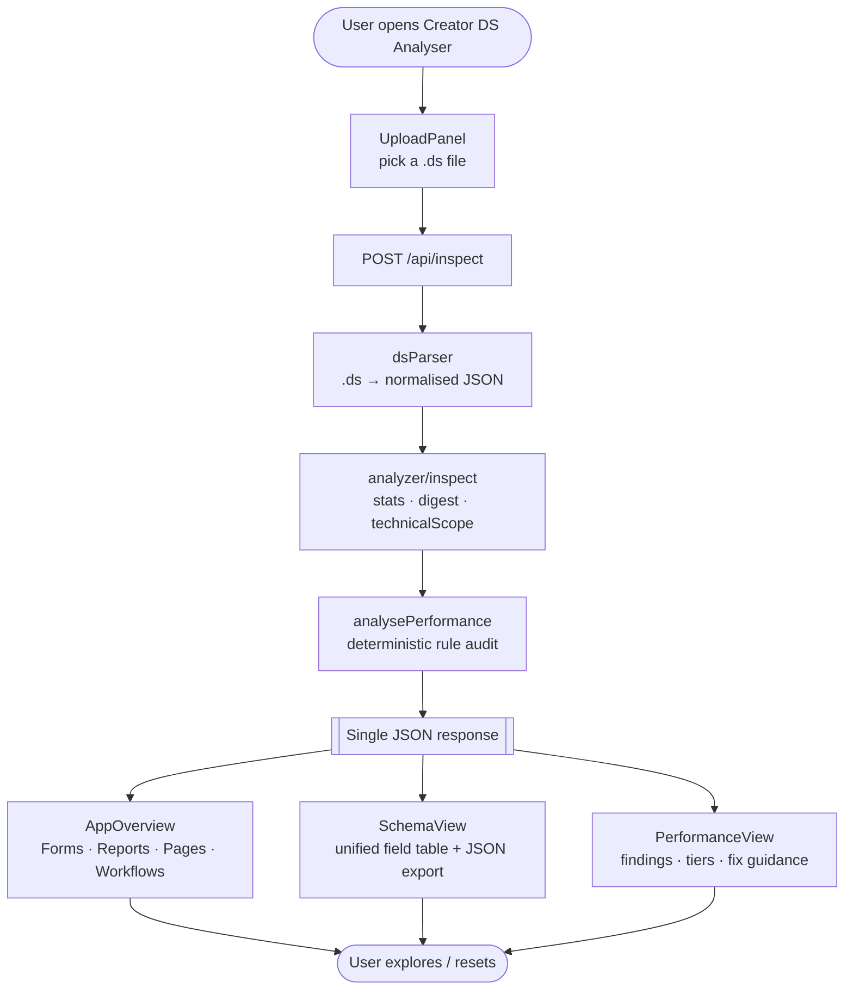
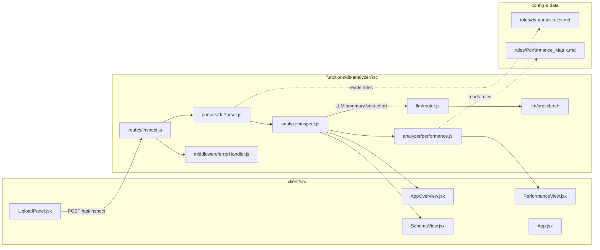
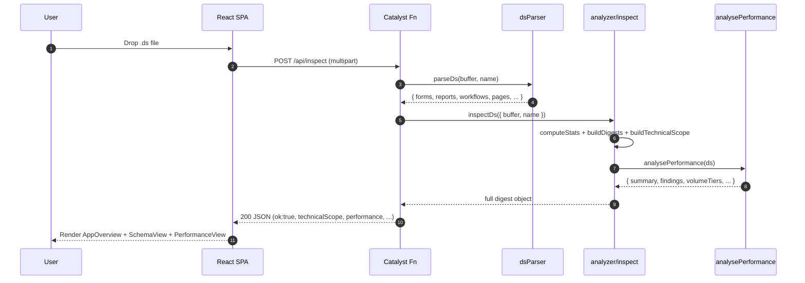
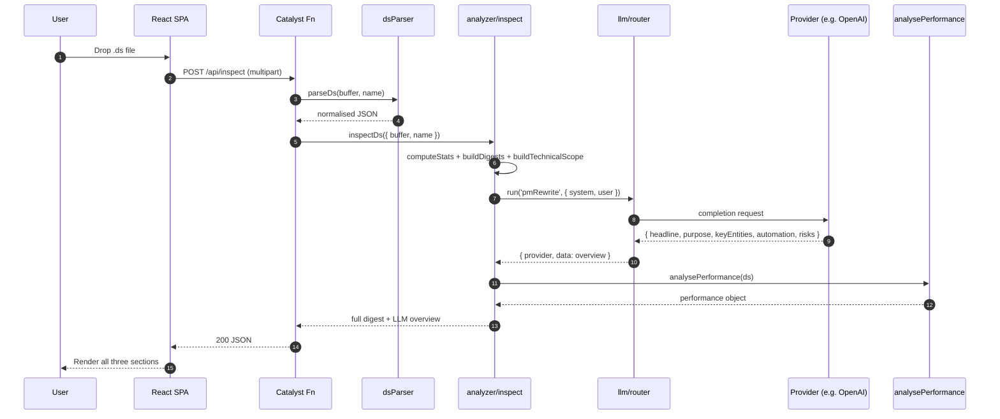
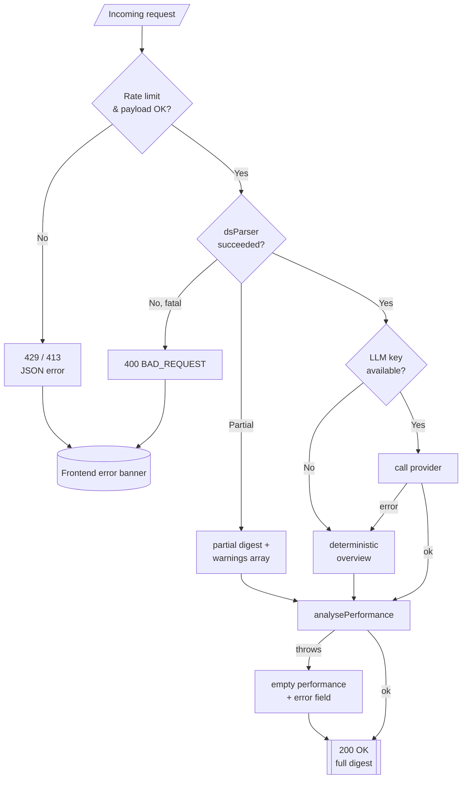
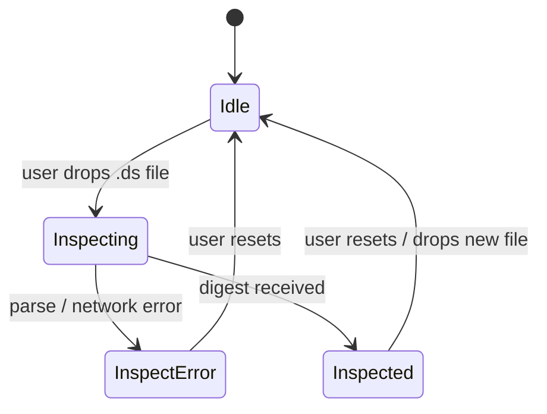
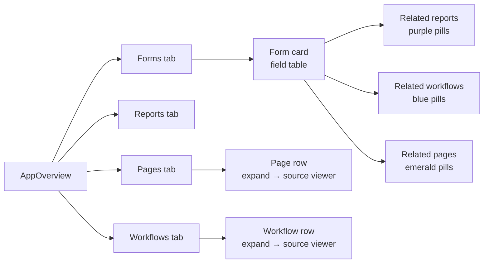

# Creator DS Analyser — Functional Flow Chart

> Companion to [`APPLICATION.md`](./APPLICATION.md).
> This file focuses purely on the **functional flow** — the sequence of
> user actions, backend stages, decision points, and outputs.
> Open it in any Markdown renderer that supports Mermaid (GitHub, VS Code
> with the Markdown preview, Zoho Code IDE, etc.).

---

## 1. Top-level functional flow

High-level view of what the application *does* from the moment a user
opens the SPA to the moment they see results.

---

## 2. Decision points, in plain English

| # | Question | If YES | If NO |
|---|----------|--------|-------|
| 1 | Did the `.ds` parse cleanly? | Return full digest | Surface `warnings[]`; still return partial digest |
| 2 | Is any LLM provider key configured? | Include LLM `overview` (headline, purpose, risks) | Use deterministic rule-based overview (no API call) |
| 3 | Did `analysePerformance` succeed? | Attach full `performance` object | Attach error stub with `{ error: "..." }` |

The app never blocks on an LLM call — it is fully functional with zero
API keys configured.

---

## 3. Per-stage responsibility chart

---

## 4. Sequence — happy path (no LLM key)

---

## 5. Sequence — happy path (with LLM key)

---

## 6. Error & fallback paths

Key guarantees:

- **No key, no problem** — the app is fully functional without any LLM keys.
- **Parser errors are soft** — the `.ds` tokeniser surfaces issues in
  `warnings[]` rather than throwing, so a partially-parseable file still
  returns a useful (if incomplete) response.
- **Performance audit errors are soft** — if `analysePerformance` throws,
  `inspectDs` catches it and returns an error stub so the other two views
  still render correctly.
- **Uniform error shape** — every failure flows through
  `middleware/errorHandler` and comes out as
  `{ "error": "...", "code": "..." }`.

---

## 7. State machine — frontend (`App.jsx`)

The frontend state machine is intentionally minimal — there is only one
server call (`POST /api/inspect`) and one result state (`Inspected`).

---

## 8. AppOverview — internal tab navigation

---

## 9. How to read / update this chart

- The chart is **intentionally functional** — modules and deployment
  concerns live in [`APPLICATION.md`](./APPLICATION.md) and
  [`ARCHITECTURE.md`](./ARCHITECTURE.md).
- When you add/remove a route, step, or decision point:
  1. Update the relevant diagram above.
  2. Update the **Decision points** table in §2.
  3. If the change is user-visible, reflect it in the
     **State machine** (§7) as well.
- Keep diagrams small — if one gets unwieldy, split it into a new
  sub-section rather than cramming more nodes.

---

## 10. Change log

| Version | Summary |
|---------|---------|
| **v1** | Initial chart (two-step LLM flow with `ResultView`). |
| **v2** | Rewritten for v0.3 single-step architecture: `ResultView` → removed; `SchemaView` + `PerformanceView` added; `AppOverview` enhanced; state machine simplified to one server call. |
