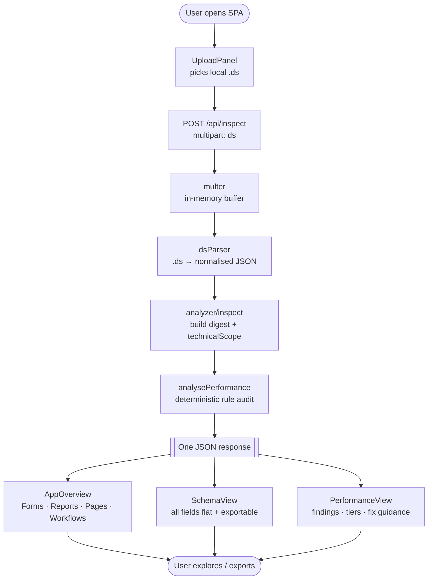

# Creator DS Analyser — Application Documentation

> **Purpose of this document:** Give any new team member (PM, developer,
> architect, QA) a complete understanding of **what this application is**,
> **why it exists**, and **how it works end-to-end** — without having to
> read every source file.
>
> This file describes the *application itself* (its code and infrastructure).
> It is **not** a description of any specific `.ds` file. Canonical
> learnings about Creator semantics, field types, and base forms live in
> [`../shared/creator-semantics/`](../shared/creator-semantics/) — consult
> those before making changes that touch Creator vocabulary.

---

## 1. What is Creator DS Analyser?

**Creator DS Analyser** is a web-based analysis tool that parses a
**Zoho Creator application export (`.ds` file)** and produces three
views of the app instantly — no requirement document needed:

| View | Audience | Content |
|------|----------|---------|
| 🗂 **Application Breakdown** | Everyone | Forms (with related reports, pages, workflows), Reports, Pages (with source), Workflows (with source) |
| 🧩 **Schema** | Developers / Architects | Flat, filterable, exportable table of every form + field across the whole app |
| ⚡ **Performance Report** | Developers / Architects | Deterministic rule-based audit (25+ rules, impact scores, volume tiers) |

It is hosted on **Zoho Catalyst** (serverless platform).

### 1.1 Project metadata

- **Name:** `creator-ds-analyser`
- **Version:** `0.3.0`
- **Runtime:** Node.js 18 (backend), React + Vite (frontend)
- **Workspace layout:** npm workspaces → `client/` + `functions/ds-analyzer/`
- **Catalyst function type:** `advancedio` (Express-compatible), 512 MB, 120 s timeout

---

## 2. Why is it used?

Zoho Creator applications grow quickly and change frequently. Manually
reading a 5 MB `.ds` export to understand its structure — which forms
exist, how they relate, what workflows fire on which events, whether the
schema is well-designed — is slow and error-prone.

The Analyser automates that reconnaissance. Three concrete benefits:

1. **Speed** — a 5 MB `.ds` is fully analysed in under 2 seconds.
2. **Shared language** — PMs see the form inventory; developers see the
   source code; architects see the performance audit — all from one upload.
3. **Deterministic output** — no LLM involved in the current UI flow.
   Parsing rules live in `rules/ds-parser-rules.md`; audit rules live in
   `rules/Performance_Matrix.md`. Both are editable Markdown files that
   change behaviour without a redeploy.

### 2.1 Primary use cases

- **Onboarding** — understand an unfamiliar Creator app in minutes.
- **Architecture review** — spot schema anti-patterns, over-fetching, and
  risky workflows before they cause production issues.
- **Pre-sales scoping** — quickly characterise a prospect's existing app.
- **QA / regression** — compare the parsed structure before and after a build.

### 2.2 Intended users

- **Product Managers** — Application Breakdown and Schema give a plain-English
  view of what's in the app.
- **Creator Developers** — Workflow/Page source-code viewer and Schema export
  are primary day-to-day tools.
- **Solution Architects** — Performance Report highlights structural risks with
  impact scores; edit `Performance_Matrix.md` to tune rules.

---

## 3. High-level architecture

```
┌──────────────────────────────────────────────────────────────────┐
│  CLIENT  (client/)  —  React + Vite + Tailwind SPA               │
│  • UploadPanel    • AppOverview    • SchemaView                  │
│  • PerformanceView               • ThemeProvider (light/dark)    │
└──────────────────────────────────────────────────────────────────┘
                         │  HTTPS (multipart/form-data)
                         ▼
┌──────────────────────────────────────────────────────────────────┐
│  CATALYST FUNCTION  (functions/ds-analyzer/)                     │
│  Express app with security middleware                            │
│                                                                  │
│  Active routes:                                                  │
│    GET  /health      → liveness probe                            │
│    POST /api/inspect → parse .ds → full digest (no LLM)          │
│                                                                  │
│  Deprecated routes (kept for tests, no UI path):                 │
│    POST /api/analyze → .ds + requirement → LLM change report     │
│                                                                  │
│  Pipeline (inspect):                                             │
│    parsers/dsParser  →  analyzer/inspect  →  analyzer/performance│
└──────────────────────────────────────────────────────────────────┘
                         │  reads (read-only)
                         ▼
┌──────────────────────────────────────────────────────────────────┐
│  CONFIG & DATA                                                   │
│  • rules/ds-parser-rules.md      — tokeniser behaviour           │
│  • rules/Performance_Matrix.md   — audit rules (25+ checks)      │
│  • docs/shared/creator-semantics/*.md — Creator domain learnings │
│  • .env                          — upload limits, CORS           │
└──────────────────────────────────────────────────────────────────┘
```

### 3.1 Backend module map (`functions/ds-analyzer/src/`)

| Path | Role | Status |
|------|------|--------|
| `index.js` | Catalyst entry point (wraps `app.js`) | ✅ Active |
| `server.js` | Local dev server (`express.listen`) | ✅ Active |
| `app.js` | Express factory: CORS, Helmet, rate-limit, routes | ✅ Active |
| `routes/health.js` | Liveness probe | ✅ Active |
| `routes/inspect.js` | Parse `.ds` only — full digest | ✅ Active |
| `routes/analyze.js` | Full LLM pipeline | ⚠️ Deprecated |
| `parsers/dsParser.js` | DSL tokeniser → normalised JSON | ✅ Active |
| `parsers/requirementParser.js` | PDF / DOCX / URL → text | ⚠️ Deprecated |
| `analyzer/inspect.js` | Stats + digests + technicalScope + LLM summary | ✅ Active |
| `analyzer/performance.js` | Deterministic rule-based audit | ✅ Active |
| `analyzer/index.js` | LLM change-detection orchestration | ⚠️ Deprecated |
| `analyzer/schema.js` | Zod schema for LLM output | ⚠️ Deprecated |
| `llm/router.js` | Provider picker (OpenAI / Anthropic / Zia / stub) | ✅ Active (used by inspect's LLM summary) |
| `llm/providers/*.js` | Provider adapters | ✅ Active |
| `utils/loadRules.js` | Loads `rules/*.md` into prompts | ✅ Active |
| `utils/errors.js` | `ApiError` typed error class | ✅ Active |
| `middleware/errorHandler.js` | Central JSON error shape | ✅ Active |

> **Deprecated modules** are kept so `tests/api.test.js` and
> `tests/routeReachability.test.js` continue to pass without modification.
> Remove them together when the two-step LLM feature is formally retired
> (see `routes/analyze.js` header for the exact removal checklist).

### 3.2 Frontend component map (`client/src/`)

| File | Role |
|------|------|
| `main.jsx` | React root, mounts `ThemeProvider` + `App` |
| `App.jsx` | Shell: upload → inspect → render three sections |
| `theme/ThemeProvider.jsx` | Light/dark mode context |
| `components/UploadPanel.jsx` | `.ds` file picker |
| `components/AppOverview.jsx` | Application Breakdown — Forms / Reports / Pages / Workflows |
| `components/SchemaView.jsx` | Form relationship graph — Forms only, linked by lookup-field edges (form → form). Parallel lookups from the same source to the same target are collapsed into one edge with a ×N badge. |
| `components/PerformanceView.jsx` | Performance audit UI |
| `components/FlowChart.jsx` | Entity relationship graph (canvas, legacy) |
| `components/FlowChartPanel.jsx` | FlowChart panel wrapper (legacy) |
| `components/Icons.jsx` | Inline SVG icon set |
| `lib/pageDownload.js` | Serialises the rendered report DOM (incl. canvas snapshots + inlined CSS) into a standalone `.html` file for the global **Download as HTML** action |

---

## 4. End-to-end flow

> 📊 See [`flowchart.md`](./flowchart.md) for Mermaid diagrams.

### 4.1 Textual walkthrough

1. **Open app** — user loads the React SPA; `ThemeProvider` sets theme.
2. **Upload** — user drops a `.ds` file on `UploadPanel`.
3. **Inspect** (`POST /api/inspect`):
   - Multer buffers the `.ds` in memory (no disk write).
   - `dsParser` tokenises the DSL (or falls back to ZIP/JSON/XML) and
     returns a fully normalised object: forms, reports, pages, workflows,
     customFunctions, roles, shareSettings, relationships.
   - `analyzer/inspect` computes stats, builds `technicalScope` (forms
     with attached workflows, edge graph), runs the optional LLM summary,
     and runs `analysePerformance` deterministically.
   - Frontend receives one JSON response containing **all three views**.
4. **Render** — three sections appear below the upload card:
   - 🗂 **Application Breakdown** (`AppOverview`) — five tabs (Forms ·
     Reports · Pages · Workflows · Permission Sets). The previous
     "Technical Scope" summary header (app name, purpose, headline,
     4 stat tiles, key-entities / automation / risks panels) was
     **removed in v0.4** to declutter the view — the tabs alone expose
     every count plus full drill-down. Forms tab: expand a form to see
     its field table, related reports, related workflows and related
     pages. *Related workflows* is filtered to `scope === 'form'` so
     function-scope (button/action) and scheduled workflows don't
     appear; clicking a pill opens a centered **modal popup**
     (`WorkflowPopup`) with an inline **"What this code does"** panel
     that walks the Deluge source statement-by-statement and renders
     a numbered step-by-step explanation (see §4.3 below), plus the
     full `.ds` source in a dark code viewer. The modal has an
     "Open in tab" shortcut for the traditional tab-expand flow and
     closes on Esc, outside click, or the ✕ button. The Workflows and
     Pages tabs also show their full source in a dark code viewer
     with copy.
   - 🧩 **Schema** (`SchemaView`) — force-directed **form relationship
     graph**. Only forms appear as nodes; edges represent lookup fields
     pointing from one form to another. A toggle switches to a flat
     **Connections** table listing every source → target lookup pair.
   - 🔐 **Permission Sets** (tab inside *Application Breakdown*) —
     expandable cards for every profile parsed from `share_settings`.
     Each card shows the profile's global flags (`Chat`, `ApiAccess`,
     `PIIAccess`, …) plus a **Forms** matrix where each row is a form
     with ✓/✗ columns for **Create · View All · Edit All · Import ·
     Export · Tab · All Fields**. Rows whose form exposes report ACLs
     have a **Related reports** toggle that expands a nested ✓/✗ grid
     with **View / Edit / Delete** per report. A compact **Pages**
     table shows `Tab` access for pages. The spreadsheet-style layout
     makes "who can do what" scannable at a glance.
   - ⚡ **Performance** (`PerformanceView`) — KPI tiles, top-10
     high-impact issues, and a filterable findings list with
     expandable snippets and fix guidance.
5. **Reset** — user can drop a new `.ds` without reloading.

### 4.2 Flow chart (Mermaid)



### 4.3 Deluge code-walker (`WorkflowDescription`)

The "What this code does" panel inside `WorkflowPopup` (and the
expanded workflow row in the Workflows tab) is produced by a
deterministic, client-side walker in `client/src/components/AppOverview.jsx`:

| Stage                | Function              | Purpose                                                                                   |
| -------------------- | --------------------- | ----------------------------------------------------------------------------------------- |
| Trigger sentence     | `describeTrigger`     | "Runs when a new record is **added** of **Student**." (from `event` + `scope` + `form`). |
| Body extraction      | `extractDelugeBody`   | Picks the `custom deluge script ( … )` body, or falls back to `actions { … }` blocks.    |
| Tokenisation         | `toLogicalLines`      | Brace/bracket-aware split on `;` so `sendmail [ … ]`, `if (…) { … }`, etc. stay intact. |
| Per-statement label  | `describeStatement`   | Regex-driven mapping of each recognised statement to a plain-English bullet.             |
| Orchestration        | `describeWorkflow`    | Emits `{ trigger, actions[], notes[] }` with dedupe + skipped-line notes.               |

The statement → description mapping is documented in full in
[`../shared/deluge-reference.md`](../shared/deluge-reference.md). Any time a new
pattern is added to `describeStatement`, the corresponding row in the
reference doc must be updated so the two stay in sync.

Supported statements today: `sendmail`, `invokeurl`, `insert into`,
record queries (`Form[cond].Field[.count|.getAll]`), record mutations
(`var.Field = value`), `input.Field = value`, `thisapp.<ns>.<fn>(...)`,
`openUrl("#Page:…")` / `openUrl("#Report:…")`, `alert "..."` / `info
"..."`, field UI verbs (`show` / `hide` / `disable` / `enable`), `for
each`, `if (...)`, and simple scalar assignments. Unrecognised
statements are counted into a muted "+N more not shown" note so the
output stays scannable.

---

## 5. Public API

### 5.1 `GET /health`

```json
{ "status": "ok" }
```

### 5.2 `POST /api/inspect`

**Content-Type:** `multipart/form-data`

| Field | Type | Required | Description |
|-------|------|----------|-------------|
| `ds` | file | ✔ | `.ds` export from Zoho Creator |

**Response (200):**
```json
{
  "ok": true,
  "meta": { "provider": "deterministic|stub|openai|...", "fileName": "...", "..." : "..." },
  "app": { "name": "", "namespace": "", "version": "", "..." : "..." },
  "stats": { "entityCounts": {}, "fields": {}, "..." : "..." },
  "forms": [...],
  "reports": [...],
  "pages": [...],
  "workflows": [...],
  "customFunctions": [...],
  "roles": [...],
  "technicalScope": {
    "forms": [{ "...fields...", "workflows": [...] }],
    "reports": [...],
    "pages": [...],
    "workflows": [...],
    "relationships": [...],
    "edgesByEntity": {}
  },
  "performance": {
    "summary": { "total": 0, "critical": 0, "warning": 0, "info": 0, "highImpact": 0 },
    "byCategory": {},
    "byRule": {},
    "findings": [...],
    "topImpact": [...],
    "volumeTiers": [...]
  },
  "overview": {
    "headline": "...",
    "purpose": "...",
    "keyEntities": [...],
    "automation": "...",
    "risks": [...]
  }
}
```

**Error response** — uniform JSON shape:
```json
{ "error": "...", "code": "..." }
```

### 5.3 `POST /api/analyze` _(deprecated — not called by the UI)_

Still mounted for backward compatibility. See `routes/analyze.js` for
the full interface.

---

## 6. Configuration

Copy `.env.example` → `.env`. Relevant variables:

| Variable | Purpose |
|----------|---------|
| `OPENAI_API_KEY` | Enables LLM summary in `/api/inspect` via OpenAI |
| `ANTHROPIC_API_KEY` | Enables LLM summary via Anthropic |
| `ZOHO_ZIA_KEY` | Enables LLM summary via Zoho Zia |
| `MAX_UPLOAD_MB` | Upload size cap (default 25) |
| `ALLOWED_ORIGINS` | CORS allowlist |

When **no provider key** is present the LLM summary falls back to a
deterministic rule-based narrative — the app is fully functional without
any API keys.

---

## 7. Running & deploying

```bash
# Install everything (root + client + function)
npm run install:all

# Local dev — two terminals
npm run dev:server    # Catalyst function emulator (port 3001)
npm run dev:client    # Vite dev server (port 5173, proxies /api → 3001)

# Tests (Jest, backend)
npm test

# Build frontend
npm run build

# Deploy to Catalyst
catalyst deploy
```

---

## 8. Security posture

| Concern | Mitigation |
|---------|-----------|
| Arbitrary file upload | Strict extension allowlist (`.ds` only on `/inspect`; `.ds` + `.pdf`/`.docx` on `/analyze`), filename sanitisation via `path.basename`, NUL/control-char rejection, `MAX_UPLOAD_MB` cap |
| ZIP bomb / path traversal | Per-entry size cap (`MAX_ENTRY_BYTES = 5 MB`), `safeEntryName()` strips `../` and leading `/` |
| SSRF via `requirementUrl` | Protocol allowlist (`http(s)` only), private-IP hostname blocklist, redirect limit of 3 |
| Prompt injection | Deluge scripts truncated to 8 000 chars; tokens/credentials stripped before any LLM call |
| Rate abuse | `express-rate-limit` on `/api/inspect` and `/api/analyze` (10 req/min/IP) |
| Error disclosure | Stack traces only in non-prod; central `errorHandler` controls the JSON shape |
| Secrets in client | All LLM keys server-side only; frontend never sees them |
| Helmet | `helmet()` sets 11 security headers on every response |

---

## 9. What this doc intentionally does **not** cover

Per [`../shared/operating-principles.md`](../shared/operating-principles.md), the following are out of scope:

- **Creator domain rules** (field-type vocabulary, base-form schemas,
  universal form-design rules). Those live in
  [`../shared/creator-semantics/`](../shared/creator-semantics/) and
  apply to **both** tools, not just this one.
- **Speculative change suggestions** that are not already implemented.
  Per Rule 3 ("Suggest freely, change carefully"), suggestions belong
  in conversation or in a new learning file under `../shared/`, not in
  this application doc.

---

## 10. Change log

| Version | Summary |
|---------|---------|
| **v1** | Initial documentation (two-step LLM flow). |
| **v2** | Reflects v0.3 single-step inspect-only architecture: `ResultView` removed, `SchemaView` + `PerformanceView` added, `AppOverview` enhanced with source-code viewer and relational cross-references. Deprecated modules annotated. |
