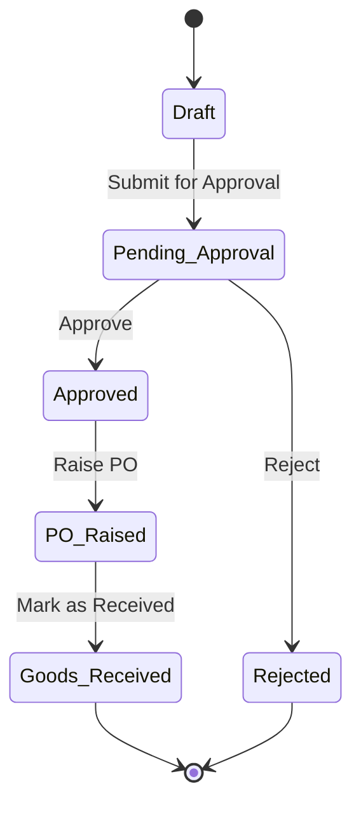

# Zoho Creator — Blueprints

> **Blueprints** are Zoho Creator's **visual process / state-machine builder**.
> They model a record's lifecycle as a sequence of **Stages** connected by **Transitions**.
> Blueprints are fundamentally different from Workflows:
>
> | | Blueprint | Workflow |
> |---|---|---|
> | **What** | Record lifecycle / process flow | Single event automation |
> | **State** | Tracks current stage on each record | Stateless |
> | **Control** | Humans manually click a Transition button | Auto-triggered by events |
> | **Multi-step?** | Yes — many stages | No — one event |
> | **Approvals?** | Via transition ownership | Via Approval Workflow |
> | **Deluge?** | Yes — per transition (Before/During/After) | Yes — per event |

---

## Blueprint Key Concepts

### Stages
A **Stage** represents a status/phase the record is in (e.g. "New", "In Review", "Approved", "Completed").
- Each record is in exactly **one stage** at any time
- The current stage is stored in a system field called **`Blueprint Stage`** on the record
- Stages are ordered but can have branching paths

### Transitions
A **Transition** is the movement from one stage to another.
- Has a **name** (shown as a button to the user, e.g. "Approve", "Reject", "Ship")
- Has a **source stage** and a **destination stage**
- Can have **criteria** (conditions that must be true for the transition to be available)
- Has **Transition Owners** (only these users see and can click the transition button)
- Contains **Deluge scripts** at three points:

| Hook | When | Can prevent? |
|---|---|---|
| **Before Transition** | Before moving to next stage | Yes — `cancel submit` |
| **During Transition** | While the stage changes | No |
| **After Transition** | After stage has changed | No |

### Transition Owners
Who is allowed to perform a transition:
- **All users** — anyone with access
- **Selected users** — specific named users
- **Selected roles** — users with a specific Creator role
- **Field-based** — the user stored in a Lookup/Users field on the record (e.g. "Assigned To")

---

## Blueprint Anatomy (Full Example)

```
Blueprint: "Purchase Order Approval"
├── Form: Purchase_Orders
├── Run when: Always (or with criteria)
│
├── Stage: [Draft]  ←── Initial stage (auto-assigned on record creation)
│   └── Transition: "Submit for Approval"
│       ├── To Stage: [Pending Approval]
│       ├── Transition Owner: Role: Requestor
│       ├── Criteria (Before State): Total_Amount > 0
│       ├── Before Transition Workflow:
│       │   └── Validate required attachments exist
│       └── After Transition Workflow:
│           └── Send email to approver
│
├── Stage: [Pending Approval]
│   ├── Transition: "Approve"
│   │   ├── To Stage: [Approved]
│   │   ├── Transition Owner: Role: Manager
│   │   ├── Before Transition: Validate approval notes filled
│   │   └── After Transition: Send approval email to requestor
│   │
│   └── Transition: "Reject"
│       ├── To Stage: [Rejected]
│       ├── Transition Owner: Role: Manager
│       └── After Transition: Send rejection email to requestor
│
├── Stage: [Approved]
│   └── Transition: "Raise PO"
│       ├── To Stage: [PO Raised]
│       ├── Transition Owner: Role: Procurement Team
│       └── After Transition: Generate PO number, notify vendor
│
├── Stage: [PO Raised]
│   └── Transition: "Mark as Received"
│       ├── To Stage: [Goods Received]
│       ├── Transition Owner: Role: Warehouse Team
│       └── After Transition: Update inventory, trigger payment workflow
│
├── Stage: [Goods Received]  ←── Terminal stage
│
└── Stage: [Rejected]         ←── Terminal stage
```

---

## Blueprint Deluge Scripts — Complete Examples

### Before Transition: Validate data before stage moves

```deluge
// Blueprint: Purchase_Order_Approval
// Transition: "Submit for Approval" | Hook: Before Transition
// Purpose: Ensure vendor is selected and amount is valid before submitting

if(input.Vendor == null || input.Vendor == "")
{
    alert "Please select a Vendor before submitting for approval.";
    cancel submit;
}

if(input.Total_Amount <= 0)
{
    alert "Total Amount must be greater than zero.";
    cancel submit;
}

// Check if supporting documents are attached
if(input.Supporting_Document == null)
{
    alert "Please attach supporting documents before submission.";
    cancel submit;
}
```

### After Transition: "Submit for Approval" — Notify approver

```deluge
// Blueprint: Purchase_Order_Approval
// Transition: "Submit for Approval" | Hook: After Transition
// Purpose: Email the approving manager when a PO is submitted

// Fetch the manager's email based on the requestor's department
rec = Purchase_Orders[ID == input.ID];
dept = Departments[ID == rec.Department];
managerEmail = dept.Manager_Email;

sendmail
[
    from: zoho.adminuserid
    to: managerEmail
    subject: "Purchase Order Approval Required — " + rec.PO_Number
    message: "<h3>A new Purchase Order requires your approval</h3>" +
             "<table border='1' cellpadding='5'>" +
             "<tr><td><b>PO Number</b></td><td>" + rec.PO_Number + "</td></tr>" +
             "<tr><td><b>Vendor</b></td><td>" + rec.Vendor_Name + "</td></tr>" +
             "<tr><td><b>Amount</b></td><td>" + rec.Currency_Type + " " + rec.Total_Amount + "</td></tr>" +
             "<tr><td><b>Requested By</b></td><td>" + rec.Added_User + "</td></tr>" +
             "</table>" +
             "<br><p>Please log in to the system to approve or reject this request.</p>"
]

// Log the submission event
insert into PO_Activity_Log
[
    Purchase_Order = input.ID
    Action = "Submitted for Approval"
    Performed_By = zoho.loginuser
    Action_Date = zoho.currenttime
    Notes = "PO submitted for manager approval"
]
```

### After Transition: "Approve" — Notify requestor + create PO

```deluge
// Blueprint: Purchase_Order_Approval
// Transition: "Approve" | Hook: After Transition

rec = Purchase_Orders[ID == input.ID];

// Auto-generate PO Number if not already set
if(rec.PO_Number == null || rec.PO_Number == "")
{
    poCount = Purchase_Orders[ID != 0].count();
    poNum = "PO-" + (zoho.currentdate.getYear().toString()) + "-" + (poCount + 1).toString().leftPad(4, "0");
    rec.PO_Number = poNum;
}

// Notify requestor
sendmail
[
    from: zoho.adminuserid
    to: rec.Requestor_Email
    subject: "✅ Your Purchase Order " + rec.PO_Number + " is Approved"
    message: "<p>Dear " + rec.Requestor_Name + ",</p>" +
             "<p>Your purchase order <b>" + rec.PO_Number + "</b> for <b>" + rec.Total_Amount + "</b> " +
             "has been approved by " + zoho.loginuser + " on " + zoho.currentdate.toString("dd-MMM-yyyy") + ".</p>"
]

// Log approval
insert into PO_Activity_Log
[
    Purchase_Order = input.ID
    Action = "Approved"
    Performed_By = zoho.loginuser
    Action_Date = zoho.currenttime
    Notes = "Approved by " + zoho.loginuser
]
```

### After Transition: "Reject" — Notify requestor

```deluge
// Blueprint: Purchase_Order_Approval
// Transition: "Reject" | Hook: After Transition

rec = Purchase_Orders[ID == input.ID];

sendmail
[
    from: zoho.adminuserid
    to: rec.Requestor_Email
    subject: "❌ Purchase Order " + rec.PO_Number + " Rejected"
    message: "<p>Dear " + rec.Requestor_Name + ",</p>" +
             "<p>Your purchase order <b>" + rec.PO_Number + "</b> has been rejected.</p>" +
             "<p><b>Reason:</b> " + input.Rejection_Reason + "</p>" +
             "<p>Please contact your manager for more information.</p>"
]

insert into PO_Activity_Log
[
    Purchase_Order = input.ID
    Action = "Rejected"
    Performed_By = zoho.loginuser
    Action_Date = zoho.currenttime
    Notes = "Rejected. Reason: " + input.Rejection_Reason
]
```

---

## Blueprints vs Approval Workflows

| Feature | Blueprint | Approval Workflow |
|---|---|---|
| Number of stages | Unlimited | Fixed levels |
| Branching | Yes (approve → Approved, reject → Rejected) | Limited (approve/reject/escalate) |
| Who triggers | Named transition owners (role/user/field) | Designated approvers by level |
| Deluge hooks | Before/During/After each transition | On Approve/On Reject actions |
| UI button | "Transition" buttons on record | Approval Center |
| Best for | Multi-team process flows | Simple manager approvals |

---

## Blueprint + Workflow Integration

Blueprints and Form Workflows **work together**. You can have:
- A **Form Workflow** on `on add` that sets initial field values
- A **Blueprint** that manages the lifecycle after that
- **Form Workflows** that also trigger when the Blueprint stage field changes (treat `Blueprint_Stage` as a field trigger)

```deluge
// Form Workflow: triggered when Blueprint_Stage field changes
// (on user input of Blueprint_Stage — Creator fires this when blueprint transitions)
// Purpose: Keep a separate "Status" dropdown in sync with blueprint stage

if(input.Blueprint_Stage == "Approved")
{
    input.Status = "Approved";
}
else if(input.Blueprint_Stage == "Rejected")
{
    input.Status = "Rejected";
}
```

---

## When to Use a Blueprint

| BRD Trigger Phrase | Use Blueprint |
|---|---|
| "Approval stages", "multi-stage approval" | ✅ |
| "Record moves through stages" | ✅ |
| "Status transitions: New → Assigned → In Progress → Closed" | ✅ |
| "Different teams handle different phases" | ✅ |
| "Track current phase of each record" | ✅ |
| "Simple: send email on create" | ❌ (use Workflow) |
| "Run at midnight every day" | ❌ (use Schedule) |

---

## Mermaid State Diagram for Blueprint


